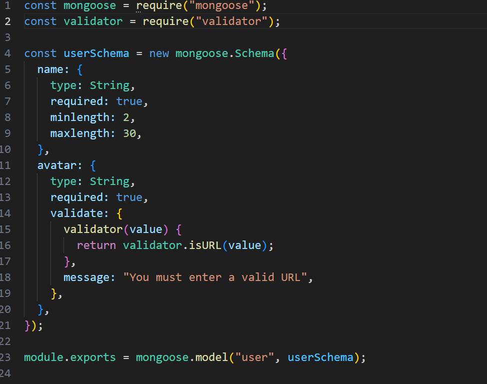
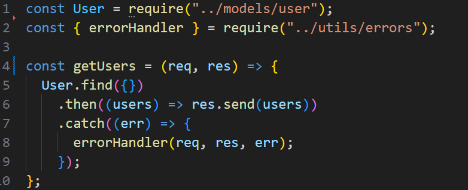
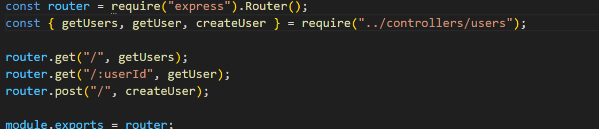
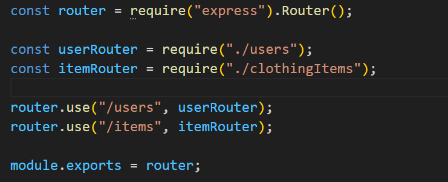
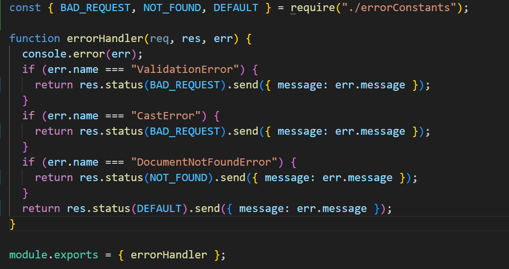

# WTWR (What to Wear?): Back End

This back-end project is focused on creating a server for the WTWR application using express. Schema models and controllers have been used by connecting them with routes to set up API functionality.

## Running the Project

`npm run start` — to launch the server

`npm run dev` — to launch the server with the hot reload feature

## Technologies and Techniques

- Schema
  

- Controller
  

- Route
  
  

- Error Handling
  

**GITHUB PAGE**

[Link to my project on Github](https://samwaxman7.github.io/se_project_express)
